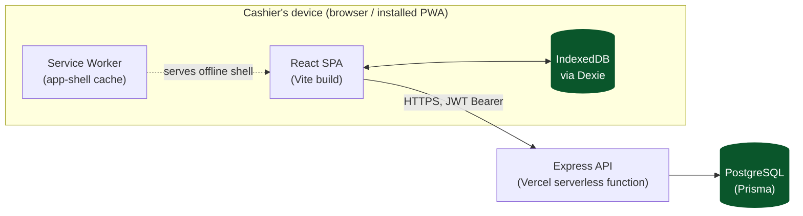
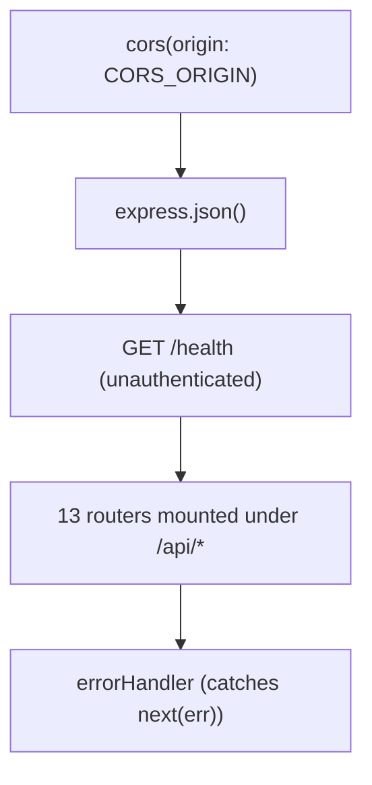
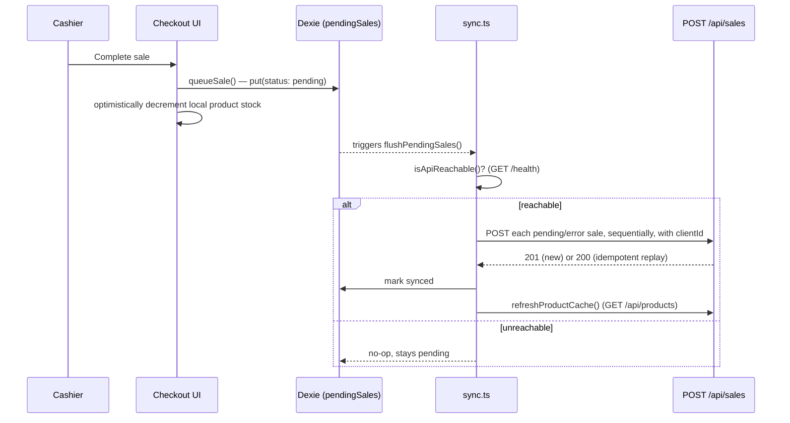
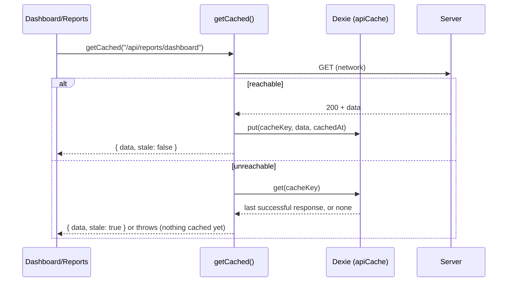
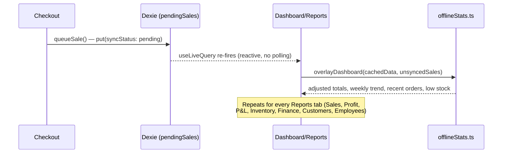
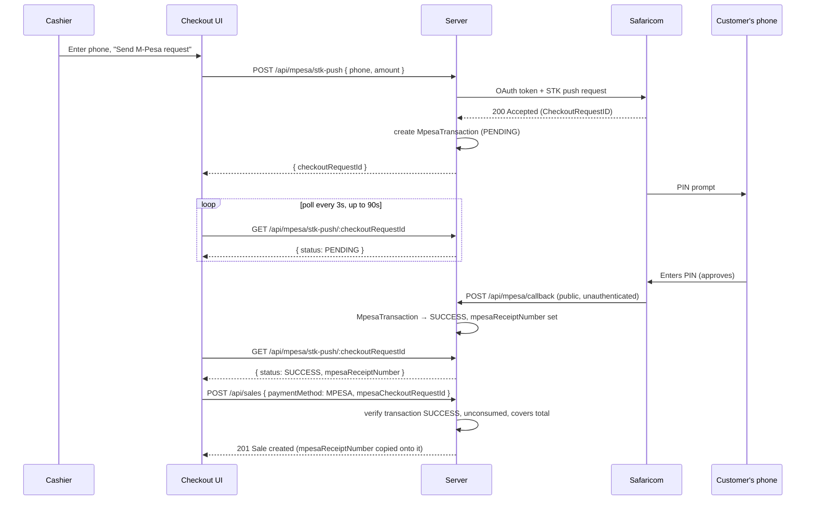

# Architecture

## System overview



Two independent deployables in one npm-workspaces monorepo:

```
server/   Express API + Prisma schema/migrations   → deployed as a Vercel serverless function
web/      React PWA frontend                       → deployed as a static Vercel site
```

They communicate over plain HTTPS/JSON; nothing is shared at runtime except the API contract
documented in [API.md](./API.md). See [DEPLOYMENT.md](./DEPLOYMENT.md) for how the two Vercel projects
are wired together.

## Backend

### Bootstrap & request pipeline

`server/src/app.ts` builds the Express app; `server/src/index.ts` is the local/dev entrypoint
(`app.listen(...)`); `server/api/index.ts` is the Vercel serverless entrypoint (re-exports the same
`app` — Vercel's rewrite rule sends every request to this one function, and Express's own router does
the real dispatch from there).

Middleware order, exactly as registered:



Each router is mounted at a fixed prefix (`/api/auth`, `/api/products`, `/api/sales`, ...) — the full
list is in [API.md](./API.md). Almost every router applies `requireAuth` at the router level via
`router.use(...)`, then layers `requireRole`/`requirePermission` on individual routes that mutate data.
There is no global rate limiting, request logging, or body-size limit configured — see
[Known gaps](#known-gaps--deferred-work) below.

### Authentication

- Login (`POST /api/auth/login`) verifies email + bcrypt password, then signs a JWT with payload
  `{ userId, storeId, role }` and a **30-day expiry**.
- The long expiry is deliberate: a till device may be offline for an entire shift or weekend, and the
  token alone isn't the final word on authorization anyway — `requireAuth` re-loads the user from the
  database on *every* request and checks `active`/`role`/`permissions` fresh each time. Disabling an
  account or changing someone's role takes effect on their very next online request, regardless of how
  long their token has left to live. The only thing the long expiry actually widens is how long a
  device that's been offline the whole time can keep working before needing to reconnect and get a
  fresh 401 check.
- The frontend separately enforces a **15-minute idle-activity timeout** entirely client-side (see
  [Session handling](#session-handling)) — this is a UX/security control layered on top of, not a
  replacement for, the JWT's own expiry.

### Authorization

Two layers — role (`User.role`) and fine-grained permissions (`User.permissions`, resolved against
role defaults) — enforced by `requireAuth` → `requireRole`/`requirePermission` middleware. Full
reference: [PERMISSIONS.md](./PERMISSIONS.md).

### Validation

Every mutating endpoint validates its request body with a [Zod](https://zod.dev) schema defined
in the route file itself (no shared schema layer) before touching Prisma. A validation failure returns
`400` with Zod's structured error. See [API.md](./API.md) for the exact schema per endpoint.

### Money & correctness rules worth knowing before you touch checkout logic

- All currency fields are Prisma `Decimal` (Postgres `DECIMAL(12,2)`/`DECIMAL(5,2)`), never `Float` —
  don't introduce float math on money fields.
- `Sale.taxTotal` is **hardcoded to `0`** in `POST /api/sales` — tax charging was deliberately removed
  because it was overcharging customers. `Store.taxRate` still exists on the schema but is not applied
  anywhere.
- A `Customer.creditLimit` of exactly `0` means **unlimited** credit, not "no credit allowed" — this is
  existing behavior baked into the credit-limit check, not a bug, but it's non-obvious from the field
  name alone.
- `Sale.clientId` is a unique, client-generated idempotency key. `POST /api/sales` treats a repeat
  `clientId` as a no-op replay (returns the existing sale, doesn't re-run any side effects). This is
  the mechanism that makes offline sale sync safe to retry.

### Destructive operations

`POST /api/settings/reset-data` wipes every business record for a store (sales, products, customers,
suppliers, expenses, promotions, etc.) while preserving `User` accounts and the `Store` row — intended
for clearing seed/test data before a store goes live. It is deliberately layered with three
independent gates, in case any one of them is bypassed or fails:

1. **Client-side**: the Settings page requires literally typing `DELETE` into a text field before the
   button becomes clickable, then a native `window.confirm()` dialog.
2. **Request-shape**: the request body must contain `{ "confirm": "DELETE" }` — the exact literal
   string, validated by Zod (`z.literal("DELETE")`).
3. **Server-side authorization**: `requireRole("ADMIN")` — not permission-based, so it can't be granted
   to a non-admin via the permissions editor.

The deletion order (`Sale` → `StockAdjustment` → `CashRegisterSession` → `CreditPayment` → `Customer` →
`SupplierTransaction` → `Supplier` → `Expense` → `ExpenseCategory` → `Income` → `Promotion` → `Coupon`
→ `Product` → `Category`) is dictated by FK `RESTRICT` constraints — see
[DATA_MODEL.md](./DATA_MODEL.md#foreign-key-on-delete-behavior-full-reference) for the full dependency
table. It runs inside one `$transaction` with a 30-second timeout so a partial wipe (some tables
cleared, others not) can't happen on failure.

## Frontend

### Routing & layout

`web/src/App.tsx` defines the route table with `react-router-dom` v6. Every route except `/login` is
wrapped in a `ProtectedRoutes` guard that redirects to `/login` if unauthenticated, and to `/` if the
user's role isn't in the route's allowed list:

| Path | Page | Roles allowed |
|---|---|---|
| `/login` | `Login` | public |
| `/` | `Dashboard` (or a redirect — see below) | any authenticated user |
| `/my-sales` | `MySales` | any authenticated user |
| `/checkout` | `Checkout` | ADMIN, MANAGER, CASHIER |
| `/register` | `CashRegisterPage` | ADMIN, MANAGER, CASHIER |
| `/inventory` | `Inventory` | ADMIN, MANAGER, STOREKEEPER |
| `/suppliers` | `Suppliers` | ADMIN, MANAGER, STOREKEEPER, ACCOUNTANT |
| `/credit-sales` | `CreditSales` | ADMIN, MANAGER, ACCOUNTANT, CASHIER |
| `/expenses` | `Expenses` | ADMIN, MANAGER, ACCOUNTANT |
| `/reports` | `Reports` | ADMIN, MANAGER, ACCOUNTANT |
| `/promotions` | `Promotions` | ADMIN, MANAGER |
| `/employees` | `Employees` | ADMIN only |
| `/settings` | `Settings` | ADMIN only |

This is role-level gating only — it does not check the finer-grained `permissions` map (that's UI-level
filtering, e.g. `Sidebar` hides nav items and `Expenses` hides its approve/reject buttons based on
`permissions`). Both layers are UX only; the API is the real authorization boundary. See
[PERMISSIONS.md](./PERMISSIONS.md).

**The one exception**: `/` is reachable by every role (it's the universal post-login landing route,
listed with no `permission` originally), but `GET /api/reports/dashboard` requires `VIEW_REPORTS` — which
CASHIER and STOREKEEPER don't have by default. `App.tsx`'s `DashboardRoute` checks this (via
`lib/navItems.ts`'s `canAccess`/`firstAccessiblePath`, the same source of truth `Sidebar` uses to decide
which nav links to show) and redirects a user without `VIEW_REPORTS` to the first page their actual
`permissions` do allow, instead of rendering `Dashboard` and letting it 403. Without this, a cashier
landed on `/` after login, `getCached("/api/reports/dashboard")` got a 403, and — because `getCached`
used to treat *any* fetch failure as "offline" — silently fell back to this device's cached dashboard data
(if any, e.g. from a previous admin session on the same device) under a misleading "Offline" banner.
`getCached` now only falls back to a cached snapshot for an actual connectivity failure (`ApiError` status
`0`); a real `401`/`403` is re-thrown so the caller can show an accurate message instead — and, for
Dashboard specifically, so the caller is never reached at all in the normal case.

Every page renders inside a shared `Layout` (`Sidebar` + content column) and independently renders its
own `Topbar` (title/subtitle + the offline/sync status pills — see below) — there's no single global
page-header component doing this centrally.

### Sales history, receipts, and undoing a sale

`web/src/components/SalesHistoryPanel.tsx` is the shared per-employee sales history UI: a payment-method
filter, a calendar date picker (jump straight to any day the employee has sales in, rather than scrolling
a mixed list), and a tap-to-expand line-item + customer breakdown per sale. It's used two ways:

- **`Reports.tsx`'s "Employees" tab** — an admin/manager/accountant (anyone with `VIEW_REPORTS`) selects
  an employee from "Sales by employee" and gets their full history, with a ✕ to collapse back.
- **`MySales.tsx`** (`/my-sales`) — every employee's *own* history, self-service, with no `VIEW_REPORTS`
  requirement (see `lib/navItems.ts` — this nav item has no `permission` gate). The authorization half of
  this lives server-side: `GET /api/sales` scopes a caller without `VIEW_REPORTS` to their own `cashierId`
  regardless of what's requested — see [API.md](./API.md#get-apisales).

`SalesHistoryPanel` also shows a per-payment-method totals strip (CASH/MPESA/CARD/.../CREDIT, each with its
total and sale count) across everything currently loaded — but **only when the viewer is an `ADMIN`**
(`useAuth()`'s `user.role`, checked client-side; this is a display-only convenience, not a security
boundary, since the underlying sales data is already scoped by the server call above).

**Undoing a sale** (`Checkout.tsx`'s "Sold the wrong thing? Undo this sale", shown on the "Sale complete"
screen) is a cashier's short-window self-service correction, not a general void tool — see
`POST /api/sales/:id/void` in [API.md](./API.md#post-apisalesidvoid) for the server-side rules (own sale,
15-minute window, `ADMIN` can void anytime). `lib/sync.ts`'s `undoLastSale()` handles both cases a sale can
be in at undo time: still only-local (never synced — just drop the queue row, nothing to reverse
server-side) or already-synced (call the void endpoint, using the sale's captured `authToken` so it's voided
as the original cashier regardless of who's logged in on the device now — same reasoning as
`PendingSale.authToken`, see the sync engine section below). Either way, stock this device had
optimistically decremented is restored, and the sale's cart is handed back to `Checkout.tsx` so the cashier
can immediately re-ring it correctly instead of re-searching every item.

**Printing a receipt** (`lib/receipt.ts`'s `printReceipt()`) opens a small popup window with a
thermal-receipt-style HTML document (store name/address/phone, line items, subtotal/discount/total,
payment method, change due, cashier and customer name) and calls the browser's print dialog on it — no
native print-driver integration. It prints the same figures already shown on the "Sale complete" screen
(what was actually charged/collected at the counter) rather than re-fetching the synced server total, so
it's available offline and always matches what the cashier and customer already agreed on. Store
name/address/phone are fetched via `getCached("/api/settings")` so the header still renders offline from
whatever this device last saw.

### Session handling

- The JWT lives in `localStorage["auth_token"]`; `src/lib/api.ts` attaches it as `Authorization: Bearer
  <token>` on every request automatically.
- On any `401` response, `api.ts` clears the stored session and dispatches a `window` event
  (`auth:session-expired`); `AuthContext` listens for that event and redirects to a "session expired"
  login screen.
- A **15-minute idle timeout**, independent of the JWT's own 30-day expiry, is enforced entirely
  client-side (`src/lib/sessionTimeout.ts`): real user input (`mousedown`/`keydown`/`touchstart`/
  `click`) resets an activity timestamp in `localStorage`; a 30-second interval (plus a check on
  `visibilitychange`/`focus`, to catch a suspended tab) checks whether that timestamp has gone stale.
  Background sync/polling deliberately does **not** count as activity. On timeout, the session is
  cleared client-side and the login page shows "logged out after 15 minutes of inactivity".
- `AuthContext` exposes `{ user, loading, sessionExpired, sessionTimedOut, login, logout }` to the rest
  of the app; `user.permissions` is the fully-resolved `PermissionMap` returned by the API, not
  recomputed client-side.

### Offline login

The idle timeout above, an explicit logout, or just reopening the app after its `auth_user` cache was
cleared all land back on the login *form* — not just a stale-but-usable session — which would otherwise
mean a device with no connectivity right now can't be used at all, undermining the point of an
offline-first POS. `AuthContext.login()` handles this: it tries the real `POST /api/auth/login` first
(with an 8s timeout, not the default 15s, so a genuinely offline attempt fails into the fallback quickly
rather than leaving the cashier watching a spinner), and only falls back to a local check when the
request fails with `ApiError.status === 0` — i.e. the server was flat-out unreachable, never actually
weighed in. A real `401` from a reachable server is left alone; the server stays authoritative whenever
it can be reached.

The local fallback (`web/src/lib/offlineAuth.ts`) is written on every *successful online* login, keyed
by email in a new Dexie table (`offlineCredentials`, schema v4):

| Field | Purpose |
|---|---|
| `salt`, `hash`, `iterations` | A PBKDF2-SHA256 hash of the password (Web Crypto, 200,000 iterations, no external dependency) — **the plaintext password itself is never stored**, only this. |
| `token` | The JWT issued by that login — offline verification can't mint a new one (no access to the server's signing secret), so a correct offline login just replays the last real one, as long as it hasn't expired. |
| `user` | The user/role/permissions snapshot from that same login, restored alongside the token. |

`tryOfflineLogin(email, password)` re-derives the hash with the stored salt/iterations and compares it
to what's cached; on a match it decodes the cached JWT's `exp` claim (no signature check — there's no
way to verify that offline anyway, and `requireAuth` re-verifies it server-side on the next real
request) to make sure it isn't already past its 30-day expiry before handing it back. Three distinct
outcomes surface as three different messages on the login form, deliberately not collapsed into one
generic "invalid credentials": no cached record for that email (`"This device hasn't seen that account
sign in before — connect online once first"`), a cached-but-expired token (`"...connect online once to
renew it"`), and a genuine password mismatch (the normal `"Invalid email or password"`).

**Why this doesn't weaken the security model**: a successful offline login never grants anything the
device didn't already have — it just decides whether to *use* an already-issued, already-cached JWT
that (like every JWT here) still gets fully re-validated by `requireAuth` against live account state the
next time it actually reaches the server. Disabling an employee's account or changing their password
takes effect the same way it already does today: on that device's next *online* request, not
instantly — this feature doesn't change that window, it only lets the login screen itself work through
it instead of blocking the whole app. The cached hash only has to resist a lost/stolen device's local
storage being read directly, not a remote attacker, which is a materially different (and much easier)
bar than what a server-side password store has to clear.

### API client (`src/lib/api.ts`)

A thin `fetch` wrapper (`apiFetch`) that adds the auth header, applies a 15-second timeout via
`AbortController` (a bare `fetch()` never times out on its own, and the offline sync queue awaits
requests serially — one hung request would otherwise stall the whole sync loop), and normalizes errors
into a typed `ApiError { status, message }`. `isApiReachable()` does a real `GET /health` round-trip
rather than trusting `navigator.onLine`, since that flag only reflects "some network interface is up,"
not "the API is actually reachable" (a classic false positive on a captive portal or dead router).

## Offline-first & sync architecture

This is the most distinctive part of the frontend, since the product's core promise is that checkout
keeps working with no connectivity.

### Local database (Dexie / IndexedDB, `web/src/db/localDb.ts`, database `"anakel-pos"`)

| Table | Purpose |
|---|---|
| `products` | A local, writable mirror of the server's product catalog — used for offline search/pricing at Checkout and for the Inventory list itself. `refreshProductCache()` upserts every server row but only deletes rows the server actually reports gone, never wiping the whole table — a product created on this device while offline lives here under a local-only id until its own sync completes (see [Offline product management](#offline-product-management)). |
| `pendingSales` | The offline sale queue. Each row has a client-generated `clientId` (`${Date.now()}-${crypto.randomUUID()}`) — the same idempotency key `POST /api/sales` dedupes on — plus a `syncStatus` of `pending`/`synced`/`error`. |
| `heldSales` | Purely local "pause and resume" cart holds, added in schema v2. These never touch the server at all — a cashier can hold and resume a cart with zero connectivity. This is a separate mechanism from the `Sale.status = HELD` value that exists in the database schema; the server-side HELD status currently has no endpoint that transitions it to COMPLETED, so in practice held/parked carts are handled entirely client-side today. |
| `apiCache` | Added in schema v3. A generic last-known-good snapshot of read-only GET responses (Dashboard/Reports stats), keyed by a stable cache key per report+period — see [Offline statistics](#offline-statistics) below. |
| `offlineCredentials` | Added in schema v4. A salted PBKDF2 hash (never the plaintext) plus the last-issued JWT per email, written on every successful online login — lets the login form itself work with no connectivity. See [Offline login](#offline-login). |
| `pendingProducts` | Added in schema v5. The offline product-create queue, one row per `queueProductCreate()` call, keyed by a local-only `clientId` that also doubles as the product's `id` in `products` until it syncs. See [Offline product management](#offline-product-management). |
| `pendingProductEdits` | Added in schema v5. The offline product-edit queue for products that already have a real server id — keyed by `productId`, so a second edit before the first syncs just overwrites the row (latest wins). |
| `pendingStockAdjustments` | Added in schema v5. The offline stock-adjustment queue for products that already have a real server id — one row per adjustment (not coalesced), mirroring the server's `StockAdjustment` audit trail. |
| `pendingProductDeletes` | Added in schema v6. The offline product-delete queue for products that already have a real server id, keyed by `productId`. |

### Sync engine (`web/src/lib/sync.ts`)



- `queueSale()` writes to `pendingSales` and immediately calls `flushPendingSales()`.
- `flushPendingSales()` is guarded by an in-memory mutex flag (not persisted — a page reload clears
  it). It sends every `pending`/`error` sale to the server **sequentially** (not in parallel), so one
  slow request doesn't race another; a single sale's failure marks it `error` with the message and
  moves on to the next rather than aborting the whole batch. If anything synced, it triggers a product
  cache refresh afterward, since server stock levels have now changed.
- `startBackgroundSync()` (called once at app startup in `main.tsx`, for the lifetime of the tab)
  registers a `window "online"` listener to retry immediately on reconnect, plus a 25-second interval
  that also retries, and every 5 minutes re-checks reachability and refreshes the product cache even if
  nothing is pending — covering two gaps a bare `online` event misses: connectivity that quietly comes
  back without firing a fresh event, and catalog data (new products, price changes) going stale over a
  long open session.
- The `Topbar` on every page reactively shows pending/error counts (via `useLiveQuery` against
  `pendingSales`) as "Offline — sales are queued on this device", "Syncing N sale(s)…", or a tap-to-retry
  "N sale(s) failed to sync" pill.
- `pendingSales` is one shared IndexedDB table for the whole device/browser — it isn't scoped per
  logged-in user. On a till shared across a shift, it's entirely normal for cashier A to ring up a sale
  offline, then log out before it syncs, with cashier B (or the admin) logging in before connectivity
  (or the next flush) actually happens. `queueSale()` therefore captures the queuing user's JWT on the
  `PendingSale` row itself (`authToken`) and `flushPendingSales()` sends each sale with `api.postAsUser()`
  using *that* token, not whatever's active in `localStorage` at flush time — so the sale is always
  attributed to whoever actually rang it up, regardless of who's logged in when it finally syncs. (A
  `tokenOverride` request failing with `401` also deliberately does not clear the ambient session or
  fire `auth:session-expired` — that token may belong to an employee who's since logged out or been
  disabled, and must never log out whoever is using the device right now.)

### What this buys you, and what it doesn't

- A cashier can search products, ring up a sale, and take cash payment fully offline; the sale is
  queued locally and reconciled with the server (including stock decrement, coupon usage, credit
  balance) as soon as connectivity returns, with no risk of double-processing on retry.
- The client-computed total shown mid-sale is explicitly an *estimate* — the server is authoritative
  and applies its own pricing tier, promotion, and coupon logic independently once the sale syncs
  (see [API.md](./API.md#post-apisales)).
- Dashboard and Reports show cached figures offline, live-adjusted for sales rung up on this device that
  haven't synced yet (see below). Inventory (adding, editing, and stock-adjusting products) also works
  fully offline — see [Offline product management](#offline-product-management) — but everything else
  (employee management, supplier ledgers, expenses/income, promotions, settings, etc.) has no offline
  support: those pages call the API directly and simply fail if unreachable.

### Offline product management

Adding a product, editing one, and adjusting stock all go through the same "write locally first, sync
after" queue shape as a sale — online or offline, there's no branching on connectivity, just a possibly
longer wait before the write reaches the server.

**Adding a product** (`queueProductCreate()`): writes a `pendingProducts` row and, in the same
transaction, an optimistic row into `products` under a **local-only id** (`local_<clientId>`, see
`isLocalProductId`/`newLocalProductId` in `db/localDb.ts`). Because Inventory and Checkout both read
from the same `products` table, the new product is immediately visible in the Inventory list *and*
searchable/sellable at Checkout — before it has ever reached the server. `POST /api/products` accepts an
optional `clientId`; if a product with that `clientId` already exists for the store, the create is
short-circuited and the existing row is returned instead — the same idempotency pattern as `Sale`, so a
retried sync after a dropped response never creates a duplicate product.

**The id remap problem**: once a locally-created product's `POST` actually succeeds, the server hands
back a real id, but everything on this device still refers to the old local one. `remapLocalProductId()`
runs immediately after that POST resolves and rewrites every local reference in one transaction: the
cached `products` row itself, and the `productId` on any not-yet-synced `pendingSales` item that already
rang up this product (a cashier can add a product and sell it before the create has even synced — that's
expected, not an edge case to avoid). One gap this doesn't cover: a cart line already open in the
Checkout UI at the exact moment the remap happens keeps its in-memory reference to the old id for the
rest of that transaction. In practice the sync window is short (seconds) and this requires adding a
product and ringing it up in the same breath as a background sync fires, so it's an accepted narrow risk
rather than something actively guarded against.

**Editing a product or adjusting its stock** (`queueProductEdit()` / `queueStockAdjustment()`): only
apply to a product that already has a real server id — `PUT /api/products/:id` and
`POST /api/products/:id/adjustments` respectively, both applied optimistically to the cached row first.
Editing a product that's *still* only a `pendingProducts` row (its own create hasn't synced yet) skips
this queue entirely — `patchPendingProduct()` patches that row directly, since there's nothing to `PUT`
against until the create itself lands; the next flush just sends the updated create payload. Unlike a
product edit (a `PUT`, safe to resend), a stock adjustment increments `stockQty` rather than overwriting
it, so `POST /api/products/:id/adjustments` also accepts an optional `clientId` for the same
retry-safety reason as `Sale`/`Product`.

**Deleting a product** (`queueProductDelete()`): removes the cached row immediately either way, so the
product disappears from Inventory/Checkout right away regardless of connectivity. A product that's still
only a `pendingProducts` row is simply cancelled outright — its create, any queued edit, and any queued
stock adjustment are all deleted locally, and nothing is ever sent to the server, since the server has
never heard of the product. A product with a real server id instead queues a `pendingProductDeletes` row
and drops any not-yet-synced edit/adjustment for it (no point syncing a change to a product about to be
deleted); `DELETE /api/products/:id` is a soft delete (`Product.active = false`), which is already
naturally safe to resend, so unlike `Product`/`StockAdjustment` this queue needs no `clientId`.

**Flush ordering**: `flushPendingSales()` always calls `flushPendingProducts()` first, before reading its
own queue — a sale referencing a brand-new local product would otherwise risk reaching the server before
that product's create has, and get rejected as an unknown product. All five flush functions
(`flushPendingSales`, `flushPendingProducts`, `flushPendingProductEdits`, `flushPendingStockAdjustments`,
`flushPendingProductDeletes`) share one in-flight-promise pattern: a call made while one is already
running returns *that* run's result instead of a stale no-op, so the background timer, the `online`
listener, and a direct call from `queueSale`/`queueProductCreate` firing within milliseconds of each
other never silently skip work.

**Gap**: Reports' Inventory tab and the P&L/Analytics COGS estimates are driven by the server's own
report endpoints, cached via `getCached()` — they reflect a product added or edited on this device only
after that write has synced and a fresh report has been fetched, not live like Dashboard/Reports' sales
overlay. A newly-added offline product shows up in Inventory and is sellable at Checkout immediately, but
won't appear in a Reports figure until it's synced.

### Offline statistics

Dashboard and every Reports tab use a shared cache-with-fallback helper (`web/src/lib/cachedFetch.ts`'s
`getCached()`) instead of calling the API directly: try the network first, and on failure fall back to
this device's own last successful response for that exact report, stored in the `apiCache` Dexie table.
Every successful fetch overwrites its cache entry, so the fallback is always the most recent data this
device has actually seen — not a fixed snapshot from first load.



Each page tracks `stale`/`cachedAt` alongside its data and shows an amber "Offline — showing figures
from `<cachedAt>`. Will update automatically once you're back online." banner instead of the data going
blank; a report that's never been successfully loaded on this device shows a plain error instead, since
there's nothing to fall back to. Both pages also listen for the `window "online"` event while mounted
and immediately re-fetch, so a screen left open through an outage catches up without a manual refresh
(same pattern the sync engine above already uses).

**Cache key vs. request URL**: for a date-ranged report, the live request always includes `to: now()`,
which differs by milliseconds on every call — using that raw URL as the cache key would mean a report
almost never actually hits the cache entry it just wrote. Reports.tsx instead derives a stable cache key
per report from the *selected period* (`"Today"`, `"This Week"`, a custom date pair, …), independent of
the exact request URL sent over the wire; `getCached(path, cacheKey)` accepts the two separately for
exactly this reason. Dashboard and the non-date-ranged reports (Inventory, Suppliers) have no such
mismatch — their path is already stable, so no separate cache key is needed.

**What this doesn't do**: cached stats reflect whatever this specific device last saw, which may lag
behind sales rung up on other tills while this one was offline — there's no cross-device merge, only
"last successful fetch, per device." This mirrors the same single-device scope every other part of the
offline layer already has (the product cache, the pending-sale queue). What the cache-fallback layer
above *doesn't* do on its own is reflect a sale rung up on **this** device after the last successful
fetch — that's what the live overlay below is for.

**Staying fresh across a day boundary**: a cached Dashboard snapshot's `todaysSalesTotal` means "today,
as of `cachedAt`" — if a device goes offline and stays that way into a new calendar day, that figure is
actually *yesterday's* total wearing today's label. `overlayDashboard()` takes `cachedAt` for exactly this
reason: when it's from a different calendar day than "now" (compared via the same UTC-day-key convention
the rest of this file already uses), the day-scoped fields (`todaysSalesTotal`, `todaysTransactionCount`)
reset to zero before any of today's actually-unsynced local sales are added back in, so a new shift never
inherits a stale prior day's number. The weekly chart gets the same treatment from the other direction: a
missing "today" bucket (the cached week was fetched before today existed) is created on demand instead of
silently dropping that day's sale from the total.

### Live overlay of unsynced sales

The cache-fallback layer above only ever shows the server's last-known snapshot — it has no way to know
about a sale that was just rung up on this device and hasn't synced yet. `web/src/lib/offlineStats.ts`
closes that gap: every overlay function takes a report snapshot (live-fetched or cache-fallback) plus
this device's currently-unsynced `pendingSales` and returns an adjusted snapshot with those sales'
effect already added in — so Dashboard and every Reports tab update the moment a sale completes,
offline or on, with no network round trip.



Each page queries `pendingSales` (filtered to `syncStatus` `pending`/`error` — never `synced`, so a sale
already reflected in the next server fetch is never double-counted) via `useLiveQuery`, which reactively
re-runs whenever that Dexie table changes — no polling, no manual refresh trigger needed. The overlay
itself is a plain `useMemo` over `{ cachedData, unsyncedSales }`, so it's pure UI-layer math with no
side effects; the cache written by `getCached()` is never mutated.

**Why every report needed its own overlay function, not one generic one**: each report aggregates sales
differently (a day-bucketed trend, a per-product breakdown, a per-payment-method split, a per-customer
top-10, a per-cashier ranking, a point-in-time stock valuation), so `overlayDashboard`,
`overlaySalesSummary`, `overlayProfit`, `overlayProfitLoss`, `overlayAnalytics`, `overlayInventory`,
`overlayFinance`, `overlayCustomers`, and `overlayEmployeePerformance` each mirror their corresponding
server route's exact aggregation logic (bucket key format, which fields sum vs. recompute, top-N
truncation) closely enough to add a local sale's effect in the same shape the server would produce.
`Suppliers` has no overlay — supplier balances aren't sales-driven.

**Inherent estimation limits** (documented in code, not hidden): this all happens before the server has
actually processed the sale, for the same reason Checkout's own on-screen total is labeled "estimated" —
- **No discount is known client-side.** A sale's estimated value is `sum(unitPrice × quantity)`; any
  promotion or coupon the server would apply on sync isn't visible yet, so the true post-sync figure can
  come in lower.
- **Tiered pricing isn't resolved client-side.** Checkout always caches retail `price`; wholesale/VIP
  pricing is resolved server-side on sync, so a tiered customer's estimate can run high until then.
- **COGS needs product cost, which checkout doesn't otherwise use.** `CachedProduct` gained a `cost`
  field (populated by `refreshProductCache()` alongside price/stock) purely so `overlayProfit`,
  `overlayProfitLoss`, and `overlayAnalytics` can estimate COGS without a network round trip.
- **Two partial-list reports (Dashboard's low-stock, the Inventory tab) only adjust products already
  present in the snapshot.** The server returns a top-10 list for Dashboard and the full active catalog
  for Inventory; a product that would newly cross its low-stock threshold purely from an offline sale
  won't appear in Dashboard's list until the next real fetch (Inventory has no such gap, since it always
  returns every product).

**Every money field arrives as a JSON string, not a number — convert before doing arithmetic on it.**
Prisma `Decimal` fields (every money field in the schema) serialize via `Decimal.prototype.toJSON()`,
which returns a string like `"340.00"`; the report TypeScript types say `number`, but that's only true
once something explicitly converts it. `currencyFmt.format(x)` and unary negation (`-x`) both happen to
coerce a string correctly, which is why the plain display code elsewhere in Reports.tsx never surfaced
this — but a bare `total += serverValue` silently does *string concatenation* instead of addition
whenever `serverValue` hasn't been converted (`"0" + 340` reads back as `340` by coincidence; `"0" + 340
+ 220` becomes `"0340220"`, which reads back as `340,220` — a wildly wrong number that only appears once
there's more than one value to accumulate, which is exactly what an overlay does). `offlineStats.ts`'s
`num()` helper wraps every `data`-sourced numeric read for this reason — treat any new field read from a
report response the same way, regardless of what the TypeScript type claims.

**Closing the "just synced" race** (`SALES_SYNCED_EVENT`, `web/src/lib/sync.ts`): when connectivity
returns, both the sync engine's `flushPendingSales()` and each report's own `"online"` refetch listener
fire off their own independent async chains. `flushPendingSales()` awaits a reachability check and then
each sale POST sequentially; a report's `GET` can easily resolve *first*, caching a genuinely fresh —
but pre-sync — snapshot with no further trigger to correct it once the sale actually finishes syncing
moments later. `flushPendingSales()` dispatches a `pos:sales-synced` `window` event once a batch
confirms at least one sale, and Dashboard/Reports listen for it alongside `"online"`, forcing a second
refetch right when the server's own numbers are guaranteed to be current.

## M-Pesa STK Push integration

Checkout offers two distinct M-Pesa payment methods, chosen at the top of the Payment panel:

- **`MPESA_MANUAL` ("M-Pesa Sale")** — the customer already paid via M-Pesa outside this system (most
  commonly by sending money directly to a till or paybill number). The cashier confirms the payment
  themselves and completes the sale exactly like CASH/CARD/BANK — no request is sent to Safaricom, no
  proof is required server-side, and it works fully offline.
- **`MPESA` ("M-Pesa Prompt")** — the live STK Push flow described below: the server sends Safaricom a
  request that pops a PIN prompt on the customer's own phone.

A standalone `MPESA` sale at checkout is backed by a real Safaricom Daraja "Lipa na M-Pesa Online" (STK
Push) integration, not just a payment-method label. This is the one part of checkout that has **no
offline path** — sending a PIN prompt to a customer's phone inherently requires connectivity — so it's
built as a linear online request/poll flow rather than going through the Dexie offline sale queue until
the payment is confirmed. `MPESA_MANUAL` has no such restriction, since it's cashier-asserted like
CASH/CARD/BANK and never talks to Safaricom.



**Server side** (`server/src/lib/mpesa.ts`, `server/src/routes/mpesa.ts`): `initiateStkPush()` handles
Daraja's OAuth dance (a Basic-auth token request, cached in memory until near expiry) and the actual STK
push call, with the customer's phone normalized from whatever format a cashier types (`07XX`, `01XX`,
`+254`, `254`) into the `2547XXXXXXXX`/`2541XXXXXXXX` form Daraja requires. `POST /api/mpesa/stk-push`
creates a `PENDING` `MpesaTransaction` row the moment Safaricom accepts the push — this is the audit
trail /state machine for the payment, independent of whether a `Sale` ever gets created from it.
`POST /api/mpesa/callback` is the one route in this codebase mounted **without** `requireAuth` — it's
Safaricom's own servers calling in, which can't attach a JWT. The unguessable `checkoutRequestId`
Safaricom itself generated is what scopes the callback to the right pending transaction; there's no
additional signature or IP-allowlist verification layered on top (see
[Known gaps](#known-gaps--deferred-work)). The callback always acks with Safaricom's expected
`{ ResultCode: 0, ResultDesc: "Accepted" }` body regardless of outcome — including for an unrecognized
or already-resolved `checkoutRequestId` — since responding with anything else risks Safaricom treating
delivery as failed and retrying indefinitely.

**Payment verification, not just a label**: `POST /api/sales` requires a standalone `MPESA` sale to
carry a `mpesaCheckoutRequestId` pointing at a transaction that is `SUCCESS`, not already linked to
another sale, and whose amount covers the computed total — the same shortfall-tolerance pattern used for
split payments, since the push amount is quoted before this request's promotions/coupon are applied. On
success the transaction is linked to the new sale (`MpesaTransaction.saleId`, unique — this is what
actually prevents the same STK push being spent on two sales) and its receipt number is copied onto
`Sale.mpesaReceiptNumber`. `MPESA_MANUAL` and `SPLIT`'s MPESA leg are deliberately **not** run through
any of this — like CASH/CARD/BANK, they're just a cashier-asserted amount; only a standalone STK-push
`MPESA` sale gets real verification.

**Frontend** (`web/src/pages/Checkout.tsx`): selecting the "M-Pesa Prompt" (`MPESA`) method replaces the normal "Complete sale" button
with a phone-number field and a "Send M-Pesa request" button. `sendMpesaPush()` is a single async
function — POST the push, then poll `GET /api/mpesa/stk-push/:checkoutRequestId` every 3 seconds for up
to 90 seconds — showing "Waiting for the customer to enter their M-Pesa PIN…" while pending. On
`SUCCESS` it calls the same `completeSale()` used by every other payment method (passing the
`checkoutRequestId` through), which queues the sale via the normal offline-sync path — at that point
connectivity is known-good, so it syncs essentially immediately. On `FAILED`/`CANCELLED`/timeout, the
cashier sees why and can retry or switch payment methods.

**Sandbox vs. production**: `MPESA_ENV` selects Safaricom's sandbox or production API base URL.
`MPESA_SHORTCODE`/`MPESA_PASSKEY` default to Safaricom's published sandbox test values (shortcode
`174379`), so the whole pipeline is testable against the sandbox the moment you register a free Daraja
app for `MPESA_CONSUMER_KEY`/`MPESA_CONSUMER_SECRET` — no code changes are needed to go to production,
only different env var values. See [DEPLOYMENT.md](./DEPLOYMENT.md#m-pesa-daraja-setup).

## PWA / service worker

Configured via `vite-plugin-pwa` in `web/vite.config.ts`, `generateSW` mode with `registerType:
"prompt"` and `injectRegister: false` (registration is done manually — see below). `navigateFallback:
"/index.html"` keeps the app shell loadable offline. Runtime caching: API calls (`/api/*`) are explicitly
`NetworkOnly` — the service worker plays no role in offline data, that's entirely the Dexie/sync layer's
job — while Google Fonts assets use `StaleWhileRevalidate`/`CacheFirst`. Manifest: `Anakel Eazzy Mart
POS`, standalone display, `theme_color`/`background_color` `#173a2a`, 192/512px icons in both `any` and
`maskable` purposes.

### Keeping an installed device up to date

An installed PWA that's just resumed from Android's app switcher — the normal way a cashier "opens" it
day to day — doesn't necessarily do a real page navigation, and a browser only checks the network for a
new service worker on navigation. Left alone, a device can install this app once and then run whatever
build was current that day indefinitely, even after many deploys, because nothing ever prompts it to
check again. This is what was behind an early real report: a phone with the app installed showed empty
Inventory/Dashboard data while the same URL in a normal browser tab on the same phone worked fine — the
installed instance was simply stuck on a stale build from before a wave of fixes.

`web/src/lib/swUpdate.ts` (wired up once in `main.tsx`) fixes this:

- Registers the service worker itself via `vite-plugin-pwa`'s `virtual:pwa-register` module
  (`registerSW()`), rather than the plugin's auto-injected script — `injectRegister: false` above turns
  that auto-injection off so there's only one registration path.
- `registerType: "prompt"` means a newly-downloaded service worker installs and then **waits** instead of
  activating itself immediately — the generated `sw.js` only calls `self.skipWaiting()` in response to an
  explicit `"SKIP_WAITING"` message, not automatically. This matters for a POS: an in-progress cart lives
  only in Checkout's React state, so silently swapping the running JS out from under a cashier mid-sale
  (which `registerType: "autoUpdate"`'s automatic `skipWaiting()` + `clientsClaim()` would do) risks losing
  it. Leaving the decision to the user avoids that.
- Since the browser won't reliably re-check on its own, `initServiceWorkerUpdates()` forces a check itself
  — polling `registration.update()` every 15 minutes, and again immediately whenever the tab/app comes
  back to the foreground (`visibilitychange` → `"visible"`, which is exactly the "resumed from the app
  switcher" moment that a bare navigation-triggered check would miss).
- When `registerSW()`'s `onNeedRefresh` fires (a new worker is installed and waiting), a small module-level
  store flips to "update available" and `<UpdateBanner />` (rendered once at the app root in `App.tsx`, so
  it shows regardless of which page is open) appears as a fixed bar reading "A new version of this app is
  available" with a "Refresh now" button. Clicking it calls the `updateSW(true)` closure `registerSW()`
  returned, which posts `SKIP_WAITING` to the waiting worker and reloads once it takes control.

Verified end-to-end with Playwright against a `vite preview` build: load the app (service worker installs
and, after a second navigation, takes control), rebuild `dist/` in place to simulate a new deploy without
restarting the server, force an update check, confirm the banner appears, click "Refresh now", and confirm
the page reloads cleanly onto the new build with the session still intact.

## Design system

Tailwind custom theme (`web/tailwind.config.js`) under the "Fresh Grocer" direction: a dark forest-green
fixed sidebar (`brand.sidebar #032110`), warm off-white canvas (`brand.bg #eeebe4`), white rounded
(`14px`) `Card` components with a subtle shadow, `Inter` for body text and `Space Grotesk` for headings/
stat values, and a small consistent palette for status (`brand.accentText` green for
positive/active, `brand.warn` red/orange for danger/overdue/error). Shared primitives live in
`web/src/components/ui.tsx` (`Card`, `StatCard`, `Switch`, `Button` with primary/secondary/danger
variants).

`web/src/components/ClearableInput.tsx` is a drop-in replacement for a plain `<input>` — same props plus
a required `onClear`, given a small "×" appears (absolutely positioned, right-aligned) once the field has
a value, clearing it in one tap. Used for every search box and most free-text fields across the app;
deliberately not used for `type="number"`/`type="date"` (their own native controls already cover this) or
`<select>`.

## Known gaps & deferred work

Worth knowing before extending this system, so you don't assume more safety net exists than actually
does:

- **No automated test suite** (no unit/integration/e2e tests committed, no CI pipeline). Verification
  today is manual: `tsc --noEmit`, `vite build`, and hand-driven browser testing per change. See
  [CONTRIBUTING.md](./CONTRIBUTING.md).
- **No rate limiting, request logging, or body-size limits** on the API.
- **No sale void/refund endpoint.** `SaleStatus` includes `VOIDED`/`REFUNDED` in the schema, but no
  route currently sets either.
- **`Promotion.productId` is not a database foreign key** — it's a plain string matched against
  `SaleItem.productId` in application code at checkout time, not enforced or cascaded at the DB level.
- **`Store.taxRate` is unused** — `Sale.taxTotal` is hardcoded to `0`.
- **Multi-store is schema-ready but not implemented** — every table has `storeId`, but there is
  currently exactly one `Store` row and nothing in auth/routing selects between multiple stores.
- **`POST /api/mpesa/callback` has no signature/IP verification.** It's protected only by the
  unguessable `checkoutRequestId` Safaricom itself generates — there's no shared-secret header check or
  IP allowlist against Safaricom's published callback source ranges. Acceptable given the rest of this
  API's current security posture (no rate limiting either), but worth revisiting before handling
  meaningfully larger transaction volumes.
- **No STK push cancel/reversal endpoint.** If a cashier abandons a push after sending it (customer
  walked away, wrong amount), the `MpesaTransaction` just sits `PENDING` until it naturally times out or
  the customer declines — there's no way to proactively cancel it server-side.
- **Offline support is scoped to Checkout/Dashboard/Reports/Inventory only** — Suppliers, Customers,
  Expenses & Income, Promotions & Coupons, Cash Register, Employees, and Settings all call the API
  directly with no offline queue, and simply fail if the device is unreachable. CSV product import
  (`ImportProductsModal`) is part of Inventory but was deliberately left online-only too — it's a bulk
  server-side operation (auto-creates categories, upserts by SKU) that doesn't fit the same per-row
  local-first queue as a single product add.
