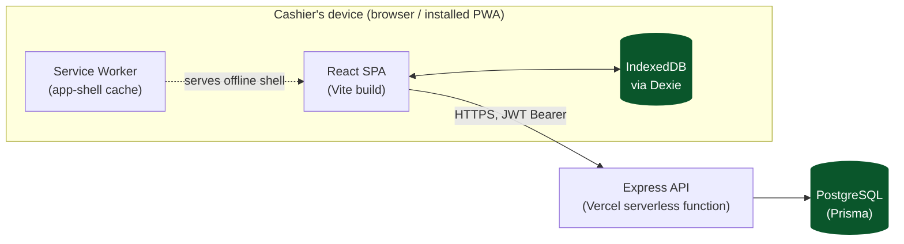
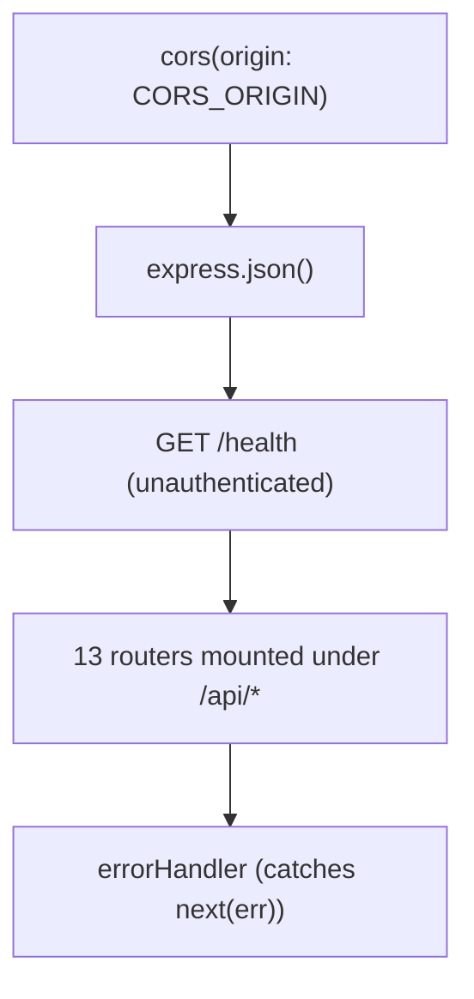
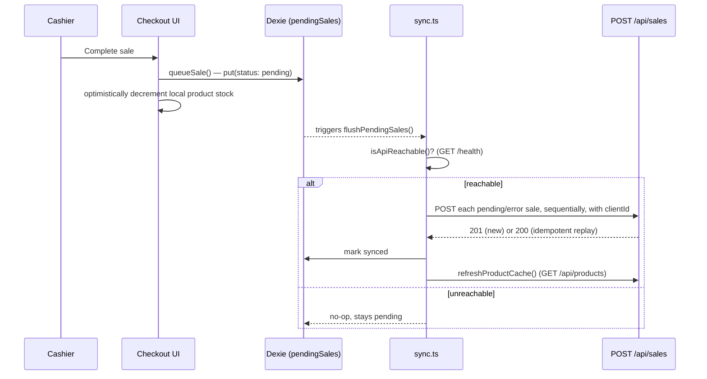
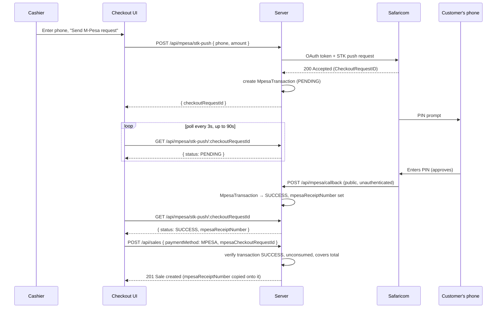

# Architecture

## System overview



Two independent deployables in one npm-workspaces monorepo:

```
server/   Express API + Prisma schema/migrations   → deployed as a Vercel serverless function
web/      React PWA frontend                       → deployed as a static Vercel site
```

They communicate over plain HTTPS/JSON; nothing is shared at runtime except the API contract
documented in [API.md](./API.md). See [DEPLOYMENT.md](./DEPLOYMENT.md) for how the two Vercel projects
are wired together.

## Backend

### Bootstrap & request pipeline

`server/src/app.ts` builds the Express app; `server/src/index.ts` is the local/dev entrypoint
(`app.listen(...)`); `server/api/index.ts` is the Vercel serverless entrypoint (re-exports the same
`app` — Vercel's rewrite rule sends every request to this one function, and Express's own router does
the real dispatch from there).

Middleware order, exactly as registered:



Each router is mounted at a fixed prefix (`/api/auth`, `/api/products`, `/api/sales`, ...) — the full
list is in [API.md](./API.md). Almost every router applies `requireAuth` at the router level via
`router.use(...)`, then layers `requireRole`/`requirePermission` on individual routes that mutate data.
There is no global rate limiting, request logging, or body-size limit configured — see
[Known gaps](#known-gaps--deferred-work) below.

### Authentication

- Login (`POST /api/auth/login`) verifies email + bcrypt password, then signs a JWT with payload
  `{ userId, storeId, role }` and a **30-day expiry**.
- The long expiry is deliberate: a till device may be offline for an entire shift or weekend, and the
  token alone isn't the final word on authorization anyway — `requireAuth` re-loads the user from the
  database on *every* request and checks `active`/`role`/`permissions` fresh each time. Disabling an
  account or changing someone's role takes effect on their very next online request, regardless of how
  long their token has left to live. The only thing the long expiry actually widens is how long a
  device that's been offline the whole time can keep working before needing to reconnect and get a
  fresh 401 check.
- The frontend separately enforces a **15-minute idle-activity timeout** entirely client-side (see
  [Session handling](#session-handling)) — this is a UX/security control layered on top of, not a
  replacement for, the JWT's own expiry.

### Authorization

Two layers — role (`User.role`) and fine-grained permissions (`User.permissions`, resolved against
role defaults) — enforced by `requireAuth` → `requireRole`/`requirePermission` middleware. Full
reference: [PERMISSIONS.md](./PERMISSIONS.md).

### Validation

Every mutating endpoint validates its request body with a [Zod](https://zod.dev) schema defined
in the route file itself (no shared schema layer) before touching Prisma. A validation failure returns
`400` with Zod's structured error. See [API.md](./API.md) for the exact schema per endpoint.

### Money & correctness rules worth knowing before you touch checkout logic

- All currency fields are Prisma `Decimal` (Postgres `DECIMAL(12,2)`/`DECIMAL(5,2)`), never `Float` —
  don't introduce float math on money fields.
- `Sale.taxTotal` is **hardcoded to `0`** in `POST /api/sales` — tax charging was deliberately removed
  because it was overcharging customers. `Store.taxRate` still exists on the schema but is not applied
  anywhere.
- A `Customer.creditLimit` of exactly `0` means **unlimited** credit, not "no credit allowed" — this is
  existing behavior baked into the credit-limit check, not a bug, but it's non-obvious from the field
  name alone.
- `Sale.clientId` is a unique, client-generated idempotency key. `POST /api/sales` treats a repeat
  `clientId` as a no-op replay (returns the existing sale, doesn't re-run any side effects). This is
  the mechanism that makes offline sale sync safe to retry.

### Destructive operations

`POST /api/settings/reset-data` wipes every business record for a store (sales, products, customers,
suppliers, expenses, promotions, etc.) while preserving `User` accounts and the `Store` row — intended
for clearing seed/test data before a store goes live. It is deliberately layered with three
independent gates, in case any one of them is bypassed or fails:

1. **Client-side**: the Settings page requires literally typing `DELETE` into a text field before the
   button becomes clickable, then a native `window.confirm()` dialog.
2. **Request-shape**: the request body must contain `{ "confirm": "DELETE" }` — the exact literal
   string, validated by Zod (`z.literal("DELETE")`).
3. **Server-side authorization**: `requireRole("ADMIN")` — not permission-based, so it can't be granted
   to a non-admin via the permissions editor.

The deletion order (`Sale` → `StockAdjustment` → `CashRegisterSession` → `CreditPayment` → `Customer` →
`SupplierTransaction` → `Supplier` → `Expense` → `ExpenseCategory` → `Income` → `Promotion` → `Coupon`
→ `Product` → `Category`) is dictated by FK `RESTRICT` constraints — see
[DATA_MODEL.md](./DATA_MODEL.md#foreign-key-on-delete-behavior-full-reference) for the full dependency
table. It runs inside one `$transaction` with a 30-second timeout so a partial wipe (some tables
cleared, others not) can't happen on failure.

## Frontend

### Routing & layout

`web/src/App.tsx` defines the route table with `react-router-dom` v6. Every route except `/login` is
wrapped in a `ProtectedRoutes` guard that redirects to `/login` if unauthenticated, and to `/` if the
user's role isn't in the route's allowed list:

| Path | Page | Roles allowed |
|---|---|---|
| `/login` | `Login` | public |
| `/` | `Dashboard` | any authenticated user |
| `/checkout` | `Checkout` | ADMIN, MANAGER, CASHIER |
| `/register` | `CashRegisterPage` | ADMIN, MANAGER, CASHIER |
| `/inventory` | `Inventory` | ADMIN, MANAGER, STOREKEEPER |
| `/suppliers` | `Suppliers` | ADMIN, MANAGER, STOREKEEPER, ACCOUNTANT |
| `/credit-sales` | `CreditSales` | ADMIN, MANAGER, ACCOUNTANT, CASHIER |
| `/expenses` | `Expenses` | ADMIN, MANAGER, ACCOUNTANT |
| `/reports` | `Reports` | ADMIN, MANAGER, ACCOUNTANT |
| `/promotions` | `Promotions` | ADMIN, MANAGER |
| `/employees` | `Employees` | ADMIN only |
| `/settings` | `Settings` | ADMIN only |

This is role-level gating only — it does not check the finer-grained `permissions` map (that's UI-level
filtering, e.g. `Sidebar` hides nav items and `Expenses` hides its approve/reject buttons based on
`permissions`). Both layers are UX only; the API is the real authorization boundary. See
[PERMISSIONS.md](./PERMISSIONS.md).

Every page renders inside a shared `Layout` (`Sidebar` + content column) and independently renders its
own `Topbar` (title/subtitle + the offline/sync status pills — see below) — there's no single global
page-header component doing this centrally.

### Session handling

- The JWT lives in `localStorage["auth_token"]`; `src/lib/api.ts` attaches it as `Authorization: Bearer
  <token>` on every request automatically.
- On any `401` response, `api.ts` clears the stored session and dispatches a `window` event
  (`auth:session-expired`); `AuthContext` listens for that event and redirects to a "session expired"
  login screen.
- A **15-minute idle timeout**, independent of the JWT's own 30-day expiry, is enforced entirely
  client-side (`src/lib/sessionTimeout.ts`): real user input (`mousedown`/`keydown`/`touchstart`/
  `click`) resets an activity timestamp in `localStorage`; a 30-second interval (plus a check on
  `visibilitychange`/`focus`, to catch a suspended tab) checks whether that timestamp has gone stale.
  Background sync/polling deliberately does **not** count as activity. On timeout, the session is
  cleared client-side and the login page shows "logged out after 15 minutes of inactivity".
- `AuthContext` exposes `{ user, loading, sessionExpired, sessionTimedOut, login, logout }` to the rest
  of the app; `user.permissions` is the fully-resolved `PermissionMap` returned by the API, not
  recomputed client-side.

### API client (`src/lib/api.ts`)

A thin `fetch` wrapper (`apiFetch`) that adds the auth header, applies a 15-second timeout via
`AbortController` (a bare `fetch()` never times out on its own, and the offline sync queue awaits
requests serially — one hung request would otherwise stall the whole sync loop), and normalizes errors
into a typed `ApiError { status, message }`. `isApiReachable()` does a real `GET /health` round-trip
rather than trusting `navigator.onLine`, since that flag only reflects "some network interface is up,"
not "the API is actually reachable" (a classic false positive on a captive portal or dead router).

## Offline-first & sync architecture

This is the most distinctive part of the frontend, since the product's core promise is that checkout
keeps working with no connectivity.

### Local database (Dexie / IndexedDB, `web/src/db/localDb.ts`, database `"anakel-pos"`)

| Table | Purpose |
|---|---|
| `products` | A flattened read-only mirror of the server's product catalog, used for offline search/pricing at checkout. Fully replaced (`clear()` + `bulkPut()`) on every refresh — no incremental diffing. |
| `pendingSales` | The offline sale queue. Each row has a client-generated `clientId` (`${Date.now()}-${crypto.randomUUID()}`) — the same idempotency key `POST /api/sales` dedupes on — plus a `syncStatus` of `pending`/`synced`/`error`. |
| `heldSales` | Purely local "pause and resume" cart holds, added in schema v2. These never touch the server at all — a cashier can hold and resume a cart with zero connectivity. This is a separate mechanism from the `Sale.status = HELD` value that exists in the database schema; the server-side HELD status currently has no endpoint that transitions it to COMPLETED, so in practice held/parked carts are handled entirely client-side today. |

### Sync engine (`web/src/lib/sync.ts`)



- `queueSale()` writes to `pendingSales` and immediately calls `flushPendingSales()`.
- `flushPendingSales()` is guarded by an in-memory mutex flag (not persisted — a page reload clears
  it). It sends every `pending`/`error` sale to the server **sequentially** (not in parallel), so one
  slow request doesn't race another; a single sale's failure marks it `error` with the message and
  moves on to the next rather than aborting the whole batch. If anything synced, it triggers a product
  cache refresh afterward, since server stock levels have now changed.
- `startBackgroundSync()` (called once at app startup in `main.tsx`, for the lifetime of the tab)
  registers a `window "online"` listener to retry immediately on reconnect, plus a 25-second interval
  that also retries, and every 5 minutes re-checks reachability and refreshes the product cache even if
  nothing is pending — covering two gaps a bare `online` event misses: connectivity that quietly comes
  back without firing a fresh event, and catalog data (new products, price changes) going stale over a
  long open session.
- The `Topbar` on every page reactively shows pending/error counts (via `useLiveQuery` against
  `pendingSales`) as "Offline — sales are queued on this device", "Syncing N sale(s)…", or a tap-to-retry
  "N sale(s) failed to sync" pill.

### What this buys you, and what it doesn't

- A cashier can search products, ring up a sale, and take cash payment fully offline; the sale is
  queued locally and reconciled with the server (including stock decrement, coupon usage, credit
  balance) as soon as connectivity returns, with no risk of double-processing on retry.
- The client-computed total shown mid-sale is explicitly an *estimate* — the server is authoritative
  and applies its own pricing tier, promotion, and coupon logic independently once the sale syncs
  (see [API.md](./API.md#post-apisales)).
- Anything that isn't checkout (reports, employee management, supplier ledgers, etc.) has no offline
  support — those pages call the API directly and simply fail if unreachable.

## M-Pesa STK Push integration

A standalone `MPESA` sale at checkout is backed by a real Safaricom Daraja "Lipa na M-Pesa Online" (STK
Push) integration, not just a payment-method label. This is the one part of checkout that has **no
offline path** — sending a PIN prompt to a customer's phone inherently requires connectivity — so it's
built as a linear online request/poll flow rather than going through the Dexie offline sale queue until
the payment is confirmed.



**Server side** (`server/src/lib/mpesa.ts`, `server/src/routes/mpesa.ts`): `initiateStkPush()` handles
Daraja's OAuth dance (a Basic-auth token request, cached in memory until near expiry) and the actual STK
push call, with the customer's phone normalized from whatever format a cashier types (`07XX`, `01XX`,
`+254`, `254`) into the `2547XXXXXXXX`/`2541XXXXXXXX` form Daraja requires. `POST /api/mpesa/stk-push`
creates a `PENDING` `MpesaTransaction` row the moment Safaricom accepts the push — this is the audit
trail /state machine for the payment, independent of whether a `Sale` ever gets created from it.
`POST /api/mpesa/callback` is the one route in this codebase mounted **without** `requireAuth` — it's
Safaricom's own servers calling in, which can't attach a JWT. The unguessable `checkoutRequestId`
Safaricom itself generated is what scopes the callback to the right pending transaction; there's no
additional signature or IP-allowlist verification layered on top (see
[Known gaps](#known-gaps--deferred-work)). The callback always acks with Safaricom's expected
`{ ResultCode: 0, ResultDesc: "Accepted" }` body regardless of outcome — including for an unrecognized
or already-resolved `checkoutRequestId` — since responding with anything else risks Safaricom treating
delivery as failed and retrying indefinitely.

**Payment verification, not just a label**: `POST /api/sales` requires a standalone `MPESA` sale to
carry a `mpesaCheckoutRequestId` pointing at a transaction that is `SUCCESS`, not already linked to
another sale, and whose amount covers the computed total — the same shortfall-tolerance pattern used for
split payments, since the push amount is quoted before this request's promotions/coupon are applied. On
success the transaction is linked to the new sale (`MpesaTransaction.saleId`, unique — this is what
actually prevents the same STK push being spent on two sales) and its receipt number is copied onto
`Sale.mpesaReceiptNumber`. `SPLIT`'s MPESA leg is deliberately **not** run through any of this — like its
other legs (CASH/CARD/BANK), it's just a cashier-asserted amount, consistent with how the rest of split
payment already works; only a standalone MPESA sale gets real STK verification.

**Frontend** (`web/src/pages/Checkout.tsx`): selecting MPESA replaces the normal "Complete sale" button
with a phone-number field and a "Send M-Pesa request" button. `sendMpesaPush()` is a single async
function — POST the push, then poll `GET /api/mpesa/stk-push/:checkoutRequestId` every 3 seconds for up
to 90 seconds — showing "Waiting for the customer to enter their M-Pesa PIN…" while pending. On
`SUCCESS` it calls the same `completeSale()` used by every other payment method (passing the
`checkoutRequestId` through), which queues the sale via the normal offline-sync path — at that point
connectivity is known-good, so it syncs essentially immediately. On `FAILED`/`CANCELLED`/timeout, the
cashier sees why and can retry or switch payment methods.

**Sandbox vs. production**: `MPESA_ENV` selects Safaricom's sandbox or production API base URL.
`MPESA_SHORTCODE`/`MPESA_PASSKEY` default to Safaricom's published sandbox test values (shortcode
`174379`), so the whole pipeline is testable against the sandbox the moment you register a free Daraja
app for `MPESA_CONSUMER_KEY`/`MPESA_CONSUMER_SECRET` — no code changes are needed to go to production,
only different env var values. See [DEPLOYMENT.md](./DEPLOYMENT.md#m-pesa-daraja-setup).

## PWA / service worker

Configured via `vite-plugin-pwa` in `web/vite.config.ts`, `generateSW` mode with `registerType:
"autoUpdate"`. `navigateFallback: "/index.html"` keeps the app shell loadable offline. Runtime caching:
API calls (`/api/*`) are explicitly `NetworkOnly` — the service worker plays no role in offline data,
that's entirely the Dexie/sync layer's job — while Google Fonts assets use
`StaleWhileRevalidate`/`CacheFirst`. Manifest: `Anakel Eazzy Mart POS`, standalone display,
`theme_color`/`background_color` `#173a2a`, 192/512px icons in both `any` and `maskable` purposes.

## Design system

Tailwind custom theme (`web/tailwind.config.js`) under the "Fresh Grocer" direction: a dark forest-green
fixed sidebar (`brand.sidebar #032110`), warm off-white canvas (`brand.bg #eeebe4`), white rounded
(`14px`) `Card` components with a subtle shadow, `Inter` for body text and `Space Grotesk` for headings/
stat values, and a small consistent palette for status (`brand.accentText` green for
positive/active, `brand.warn` red/orange for danger/overdue/error). Shared primitives live in
`web/src/components/ui.tsx` (`Card`, `StatCard`, `Switch`, `Button` with primary/secondary/danger
variants).

## Known gaps & deferred work

Worth knowing before extending this system, so you don't assume more safety net exists than actually
does:

- **No automated test suite** (no unit/integration/e2e tests committed, no CI pipeline). Verification
  today is manual: `tsc --noEmit`, `vite build`, and hand-driven browser testing per change. See
  [CONTRIBUTING.md](./CONTRIBUTING.md).
- **No rate limiting, request logging, or body-size limits** on the API.
- **No sale void/refund endpoint.** `SaleStatus` includes `VOIDED`/`REFUNDED` in the schema, but no
  route currently sets either.
- **`Promotion.productId` is not a database foreign key** — it's a plain string matched against
  `SaleItem.productId` in application code at checkout time, not enforced or cascaded at the DB level.
- **`Store.taxRate` is unused** — `Sale.taxTotal` is hardcoded to `0`.
- **Multi-store is schema-ready but not implemented** — every table has `storeId`, but there is
  currently exactly one `Store` row and nothing in auth/routing selects between multiple stores.
- **`POST /api/mpesa/callback` has no signature/IP verification.** It's protected only by the
  unguessable `checkoutRequestId` Safaricom itself generates — there's no shared-secret header check or
  IP allowlist against Safaricom's published callback source ranges. Acceptable given the rest of this
  API's current security posture (no rate limiting either), but worth revisiting before handling
  meaningfully larger transaction volumes.
- **No STK push cancel/reversal endpoint.** If a cashier abandons a push after sending it (customer
  walked away, wrong amount), the `MpesaTransaction` just sits `PENDING` until it naturally times out or
  the customer declines — there's no way to proactively cancel it server-side.
