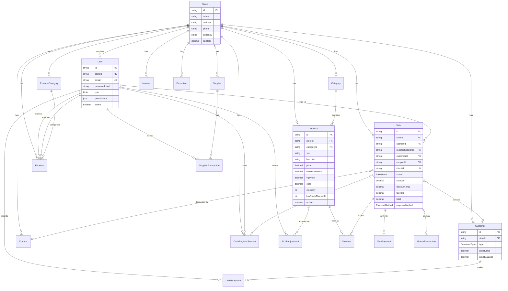

# Data Model

Source of truth: [`server/prisma/schema.prisma`](../server/prisma/schema.prisma). This document is a
human-readable reference generated from that schema — if the two disagree, the schema file wins.

## Design principles

- **Every business table carries a `storeId`.** The product only ever runs a single `Store` row today,
  but scoping every query by `storeId` from day one means a future multi-store rollout is a config
  change, not a data migration.
- **Money is `Decimal`, never `Float`.** All currency columns use Postgres `DECIMAL(12,2)` (or
  `DECIMAL(5,2)` for percentages) via Prisma's `Decimal` type, to avoid floating-point rounding errors
  in totals.
- **Soft delete for anything referenced by history.** `Product`, `Promotion`, and `Coupon` are
  deactivated (`active: false`) rather than deleted, because `SaleItem.productId` and `Sale.couponId`
  must keep resolving for historical sales. `Category`/`Supplier`/`Customer`/etc. are hard-deleted
  since nothing but their own children reference them directly.
- **`clientId` is the offline idempotency key.** `Sale.clientId` is a client-generated unique string;
  the API treats a POST with an already-seen `clientId` as a no-op replay rather than a duplicate sale.
  See [ARCHITECTURE.md](./ARCHITECTURE.md#offline-first--sync-architecture).

## Entity-relationship diagram

## Enums

| Enum | Values |
|---|---|
| `Role` | `ADMIN`, `MANAGER`, `CASHIER`, `STOREKEEPER`, `ACCOUNTANT` |
| `CustomerType` | `RETAIL`, `WHOLESALE`, `VIP` |
| `SupplierTransactionType` | `PURCHASE`, `PAYMENT` |
| `ExpenseStatus` | `PENDING`, `APPROVED`, `REJECTED` |
| `PromotionType` | `PERCENTAGE_DISCOUNT`, `FIXED_DISCOUNT`, `BOGO` |
| `DiscountType` | `PERCENTAGE`, `FIXED` |
| `PaymentMethod` | `CASH`, `MPESA_MANUAL`, `MPESA`, `CARD`, `BANK`, `SPLIT`, `CREDIT` — `MPESA_MANUAL` is a cashier-asserted M-Pesa payment (no STK push); `MPESA` is STK push-verified, see API.md |
| `SaleStatus` | `HELD`, `COMPLETED`, `VOIDED`, `REFUNDED` — note: `VOIDED`/`REFUNDED` exist in the schema but no route currently sets them; there is no void/refund endpoint yet. |
| `RegisterSessionStatus` | `OPEN`, `CLOSED` |
| `StockAdjustmentReason` | `RECEIVED_STOCK`, `DAMAGE`, `THEFT_LOSS`, `RECOUNT`, `MANUAL_CORRECTION` |
| `MpesaTransactionStatus` | `PENDING`, `SUCCESS`, `FAILED`, `CANCELLED` |

## Tables

### Store

The single tenant record. One row today; every other table's `storeId` points here.

| Field | Type | Notes |
|---|---|---|
| `id` | String (cuid) | PK |
| `name` | String | |
| `address` | String? | |
| `phone` | String? | |
| `currency` | String | default `"KES"` |
| `taxRate` | Decimal(5,2) | default `16`; **not currently applied** — see [API.md](./API.md), `Sale.taxTotal` is hardcoded to 0 |
| `createdAt` / `updatedAt` | DateTime | |

### User

Employee accounts. `email` is globally unique (not just per-store).

| Field | Type | Notes |
|---|---|---|
| `id` | String (cuid) | PK |
| `storeId` | String | FK → `Store.id`, **RESTRICT** |
| `name` | String | |
| `email` | String | **unique** |
| `passwordHash` | String | bcrypt, cost 10 |
| `role` | Role | default `CASHIER` |
| `permissions` | Json? | nullable per-employee override map; `null` = pure role defaults. See [PERMISSIONS.md](./PERMISSIONS.md) |
| `active` | Boolean | default `true`; disabling a user takes effect on their next authenticated request |
| `createdAt` / `updatedAt` | DateTime | |

Index: `[storeId]`.

### Category

| Field | Type | Notes |
|---|---|---|
| `id` | String (cuid) | PK |
| `storeId` | String | FK → `Store.id`, RESTRICT |
| `name` | String | |
| `createdAt` / `updatedAt` | DateTime | |

Constraints: `@@unique([storeId, name])`, index `[storeId]`.

### Product

| Field | Type | Notes |
|---|---|---|
| `id` | String (cuid) | PK |
| `storeId` | String | FK → `Store.id`, RESTRICT |
| `categoryId` | String? | FK → `Category.id`, **SET NULL** |
| `name` | String | |
| `sku` | String | unique per store |
| `barcode` | String? | |
| `price` | Decimal(12,2) | retail price, required |
| `wholesalePrice` | Decimal(12,2)? | used for `WHOLESALE` customers if set |
| `vipPrice` | Decimal(12,2)? | used for `VIP` customers if set |
| `cost` | Decimal(12,2)? | unit cost, used for COGS/profit reports |
| `stockQty` | Int | default `0` |
| `lowStockThreshold` | Int | default `5` |
| `imageUrl` | String? | |
| `active` | Boolean | default `true` — **soft delete flag**; `DELETE /api/products/:id` sets this rather than removing the row |
| `createdAt` / `updatedAt` | DateTime | |
| `clientId` | String? | idempotency key for a product created offline — see [API.md](./API.md#post-apiproducts--put-apiproductsid) |

Constraints: `@@unique([storeId, sku])`, `@@unique([clientId])`, indexes `[storeId]`, `[storeId, barcode]`.

### Sale

The checkout record. One row per transaction (cash sale, credit sale, or held cart).

| Field | Type | Notes |
|---|---|---|
| `id` | String (cuid) | PK |
| `storeId` | String | FK → `Store.id`, RESTRICT |
| `cashierId` | String | FK → `User.id`, RESTRICT |
| `registerSessionId` | String? | FK → `CashRegisterSession.id`, **SET NULL** — null if no drawer was open |
| `customerId` | String? | FK → `Customer.id`, SET NULL |
| `couponId` | String? | FK → `Coupon.id`, SET NULL |
| `clientId` | String | **unique** — client-generated idempotency key, see [ARCHITECTURE.md](./ARCHITECTURE.md) |
| `status` | SaleStatus | default `COMPLETED` |
| `subtotal` | Decimal(12,2) | sum of line totals before discount |
| `discountTotal` | Decimal(12,2) | default `0`; promotions + coupon combined, capped at subtotal |
| `taxTotal` | Decimal(12,2) | always `0` — tax charging was intentionally removed (see API.md) |
| `total` | Decimal(12,2) | `subtotal - discountTotal + taxTotal` |
| `amountTendered` | Decimal(12,2)? | |
| `changeDue` | Decimal(12,2)? | |
| `paymentMethod` | PaymentMethod | default `CASH` |
| `creditDueDate` | DateTime? | only for `CREDIT` sales |
| `mpesaReceiptNumber` | String? | copied from the linked `MpesaTransaction` once its STK push succeeds, for a join-free receipt/report lookup |
| `createdAt` | DateTime | can be backdated by the client on offline sync so held-then-synced sales keep their real timestamp |
| `updatedAt` / `syncedAt` | DateTime | |

Indexes: `[storeId]`, `[storeId, createdAt]`.

### SaleItem

Line items. Snapshots `name`/`unitPrice` at time of sale so historical receipts don't change if the
product is later renamed or repriced.

| Field | Type | Notes |
|---|---|---|
| `id` | String (cuid) | PK |
| `saleId` | String | FK → `Sale.id`, **CASCADE** |
| `productId` | String | FK → `Product.id`, RESTRICT — a product can't be hard-deleted while sale history references it |
| `name` | String | snapshot |
| `unitPrice` | Decimal(12,2) | snapshot (post tier-pricing) |
| `quantity` | Int | |
| `lineTotal` | Decimal(12,2) | `unitPrice * quantity`, before promotion discount |

Index: `[saleId]`.

### SalePayment

Only populated when `Sale.paymentMethod === SPLIT` — the per-method breakdown of a split payment.

| Field | Type | Notes |
|---|---|---|
| `id` | String (cuid) | PK |
| `saleId` | String | FK → `Sale.id`, **CASCADE** |
| `method` | PaymentMethod | one of CASH/MPESA/CARD/BANK |
| `amount` | Decimal(12,2) | |

Index: `[saleId]`.

### MpesaTransaction

One row per Safaricom STK Push request — the state machine for a live M-Pesa payment, from the moment
the push is sent through to the customer's phone until Safaricom's callback reports the outcome. See
[ARCHITECTURE.md](./ARCHITECTURE.md#m-pesa-stk-push-integration) for the full flow.

| Field | Type | Notes |
|---|---|---|
| `id` | String (cuid) | PK |
| `storeId` | String | FK → `Store.id`, RESTRICT |
| `cashierId` | String | FK → `User.id`, RESTRICT — who initiated the push |
| `phone` | String | normalized Kenyan MSISDN (`2547XXXXXXXX`/`2541XXXXXXXX`) |
| `amount` | Decimal(12,2) | the amount quoted in the push |
| `merchantRequestId` | String | Safaricom's own request id |
| `checkoutRequestId` | String | **unique** — the token both the status-poll and callback routes look this row up by |
| `status` | MpesaTransactionStatus | default `PENDING` |
| `resultCode` | Int? | Safaricom's numeric result code, set once resolved |
| `resultDesc` | String? | Safaricom's human-readable result description |
| `mpesaReceiptNumber` | String? | set on `SUCCESS` only |
| `saleId` | String? | FK → `Sale.id`, **SET NULL** — **unique**; set once a `Sale` is created from this transaction, so it can't be reused for a second sale |
| `createdAt` / `updatedAt` | DateTime | |

Index: `[storeId]`.

### CashRegisterSession

One row per cash-drawer shift (open → close).

| Field | Type | Notes |
|---|---|---|
| `id` | String (cuid) | PK |
| `storeId` | String | FK → `Store.id`, RESTRICT |
| `cashierId` | String | FK → `User.id`, RESTRICT |
| `status` | RegisterSessionStatus | default `OPEN` |
| `openingFloat` | Decimal(12,2) | required |
| `closingCounted` | Decimal(12,2)? | set on close |
| `expectedCash` | Decimal(12,2)? | `openingFloat + sum(CASH sale totals in session)`, computed on close |
| `variance` | Decimal(12,2)? | `closingCounted - expectedCash` |
| `openedAt` | DateTime | default now |
| `closedAt` | DateTime? | |
| `notes` | String? | |

Index: `[storeId]`.

### StockAdjustment

An audit trail entry for any manual change to `Product.stockQty` outside of a sale (receiving stock,
loss, recount, etc.).

| Field | Type | Notes |
|---|---|---|
| `id` | String (cuid) | PK |
| `storeId` | String | FK → `Store.id`, RESTRICT |
| `productId` | String | FK → `Product.id`, RESTRICT |
| `userId` | String | FK → `User.id`, RESTRICT — who made the adjustment |
| `reason` | StockAdjustmentReason | required |
| `quantityDelta` | Int | signed; applied to `Product.stockQty` in the same transaction |
| `notes` | String? | |
| `createdAt` | DateTime | default now |
| `clientId` | String? | idempotency key for an adjustment queued offline — see [API.md](./API.md#post-apiproductsidadjustments) |

Constraints: `@@unique([clientId])`. Indexes: `[storeId]`, `[productId]`.

### Customer

| Field | Type | Notes |
|---|---|---|
| `id` | String (cuid) | PK |
| `storeId` | String | FK → `Store.id`, RESTRICT |
| `name` | String | |
| `phone` | String? | |
| `email` | String? | |
| `type` | CustomerType | default `RETAIL`; drives tiered pricing at checkout |
| `creditLimit` | Decimal(12,2) | default `0` — **`0` means unlimited**, not "no credit allowed"; see API.md |
| `creditBalance` | Decimal(12,2) | default `0`; increases on CREDIT sales, decreases on `CreditPayment` |

Index: `[storeId]`.

### CreditPayment

A payment recorded against a customer's `creditBalance`.

| Field | Type | Notes |
|---|---|---|
| `id` | String (cuid) | PK |
| `storeId` | String | FK → `Store.id`, RESTRICT |
| `customerId` | String | FK → `Customer.id`, RESTRICT |
| `amount` | Decimal(12,2) | required |
| `notes` | String? | |
| `recordedById` | String | FK → `User.id`, RESTRICT |
| `createdAt` | DateTime | default now |

Indexes: `[storeId]`, `[customerId]`.

### Supplier

| Field | Type | Notes |
|---|---|---|
| `id` | String (cuid) | PK |
| `storeId` | String | FK → `Store.id`, RESTRICT |
| `name` | String | |
| `phone` / `email` / `address` | String? | |
| `balance` | Decimal(12,2) | default `0` — what the store owes the supplier |
| `createdAt` / `updatedAt` | DateTime | |

Index: `[storeId]`.

### SupplierTransaction

| Field | Type | Notes |
|---|---|---|
| `id` | String (cuid) | PK |
| `storeId` | String | FK → `Store.id`, RESTRICT |
| `supplierId` | String | FK → `Supplier.id`, RESTRICT |
| `type` | SupplierTransactionType | `PURCHASE` increases `Supplier.balance`, `PAYMENT` decreases it |
| `amount` | Decimal(12,2) | required |
| `description` | String? | |
| `recordedById` | String | FK → `User.id`, RESTRICT |
| `createdAt` | DateTime | default now |

Indexes: `[storeId]`, `[supplierId]`.

### ExpenseCategory

| Field | Type | Notes |
|---|---|---|
| `id` | String (cuid) | PK |
| `storeId` | String | FK → `Store.id`, RESTRICT |
| `name` | String | |
| `createdAt` | DateTime | default now |

Constraints: `@@unique([storeId, name])`, index `[storeId]`.

### Expense

Goes through an approval workflow: any authenticated employee can submit one (`PENDING`); only
someone with `MANAGE_EXPENSES` can approve/reject it, and only while it's still `PENDING`.

| Field | Type | Notes |
|---|---|---|
| `id` | String (cuid) | PK |
| `storeId` | String | FK → `Store.id`, RESTRICT |
| `categoryId` | String | FK → `ExpenseCategory.id`, RESTRICT |
| `amount` | Decimal(12,2) | required |
| `description` | String? | |
| `date` | DateTime | default now |
| `status` | ExpenseStatus | default `PENDING` |
| `requestedById` | String | FK → `User.id`, RESTRICT (relation `ExpenseRequestedBy`) |
| `approvedById` | String? | FK → `User.id`, **SET NULL** (relation `ExpenseApprovedBy`) |
| `createdAt` / `updatedAt` | DateTime | |

Index: `[storeId]`.

### Income

Miscellaneous non-sales income (no approval workflow).

| Field | Type | Notes |
|---|---|---|
| `id` | String (cuid) | PK |
| `storeId` | String | FK → `Store.id`, RESTRICT |
| `source` | String | |
| `amount` | Decimal(12,2) | required |
| `description` | String? | |
| `date` | DateTime | default now |
| `createdAt` | DateTime | default now |

Index: `[storeId]`.

### Promotion

Storewide or single-product discount active over a date range.

| Field | Type | Notes |
|---|---|---|
| `id` | String (cuid) | PK |
| `storeId` | String | FK → `Store.id`, RESTRICT |
| `name` | String | |
| `type` | PromotionType | `PERCENTAGE_DISCOUNT` \| `FIXED_DISCOUNT` \| `BOGO` |
| `discountPercent` | Decimal(5,2)? | for `PERCENTAGE_DISCOUNT` |
| `discountAmount` | Decimal(12,2)? | for `FIXED_DISCOUNT` |
| `productId` | String? | **plain string field, not a database foreign key** — matched against `SaleItem.productId` in application code at checkout time. `null` = storewide promotion. |
| `startDate` / `endDate` | DateTime | required; a promotion only applies while `startDate <= now <= endDate` |
| `active` | Boolean | default `true` — soft delete flag |
| `createdAt` / `updatedAt` | DateTime | |

Indexes: `[storeId]`, `[storeId, active, startDate, endDate]`.

### Coupon

Code-based discount, redeemed manually at checkout.

| Field | Type | Notes |
|---|---|---|
| `id` | String (cuid) | PK |
| `storeId` | String | FK → `Store.id`, RESTRICT |
| `code` | String | unique per store, stored uppercased |
| `discountType` | DiscountType | `PERCENTAGE` \| `FIXED` |
| `discountValue` | Decimal(12,2) | required |
| `expiresAt` | DateTime? | |
| `usageLimit` | Int? | null = unlimited |
| `timesUsed` | Int | default `0`, incremented on each completed sale that redeems it |
| `active` | Boolean | default `true` — soft delete flag |
| `createdAt` | DateTime | default now |

Constraints: `@@unique([storeId, code])`, index `[storeId]`.

## Foreign key `ON DELETE` behavior (full reference)

Confirmed against the generated migration SQL, not just the Prisma schema annotations.

| Relation | Behavior |
|---|---|
| every `*.storeId → Store.id` | **RESTRICT** — a `Store` can never be deleted while any business row exists |
| `Product.categoryId → Category.id` | **SET NULL** |
| `Sale.cashierId → User.id` | RESTRICT |
| `Sale.registerSessionId → CashRegisterSession.id` | SET NULL |
| `Sale.customerId → Customer.id` | SET NULL |
| `Sale.couponId → Coupon.id` | SET NULL |
| `SaleItem.saleId → Sale.id` | **CASCADE** |
| `SaleItem.productId → Product.id` | RESTRICT |
| `SalePayment.saleId → Sale.id` | **CASCADE** |
| `CashRegisterSession.cashierId → User.id` | RESTRICT |
| `StockAdjustment.productId → Product.id` | RESTRICT |
| `StockAdjustment.userId → User.id` | RESTRICT |
| `CreditPayment.customerId → Customer.id` | RESTRICT |
| `CreditPayment.recordedById → User.id` | RESTRICT |
| `SupplierTransaction.supplierId → Supplier.id` | RESTRICT |
| `SupplierTransaction.recordedById → User.id` | RESTRICT |
| `Expense.categoryId → ExpenseCategory.id` | RESTRICT |
| `Expense.requestedById → User.id` | RESTRICT |
| `Expense.approvedById → User.id` | SET NULL |
| `MpesaTransaction.storeId → Store.id` | RESTRICT |
| `MpesaTransaction.cashierId → User.id` | RESTRICT |
| `MpesaTransaction.saleId → Sale.id` | SET NULL |

All foreign keys use `ON UPDATE CASCADE`. Only `Sale`/`SaleItem`/`SalePayment` cascade-delete anything —
which is exactly why [`POST /api/settings/reset-data`](./API.md#post-apisettingsreset-data) deletes
`MpesaTransaction` and `Sale` rows first: every RESTRICT-guarded table downstream of a sale (customers,
products, register sessions, etc.) can't be cleared until the sales referencing them are gone.

## Migration history

| Migration | Adds |
|---|---|
| `20260707064306_init` | `Store`, `User`, `Category`, `Product`, `Sale`, `SaleItem`, `CashRegisterSession`, `StockAdjustment` |
| `20260707202143_phase2_suppliers_credit_expenses_promotions` | `Customer`, `CreditPayment`, `Supplier`, `SupplierTransaction`, `ExpenseCategory`, `Expense`, `Income`, `Promotion`, `Coupon`, plus `Sale.customerId` / `Sale.couponId` |
| `20260708101518_split_payments` | `SalePayment` |
| `20260709071239_add_user_permissions` | `User.permissions` (JSONB) |
| `20260713113021_add_mpesa_transactions` | `MpesaTransaction`, `MpesaTransactionStatus`, plus `Sale.mpesaReceiptNumber` |

Run `npm run db:migrate --workspace server` to apply pending migrations locally (creates a new one if
the schema has diverged); `prisma migrate deploy` (run automatically by the `vercel-build` script) to
apply already-committed migrations in production without prompting.
